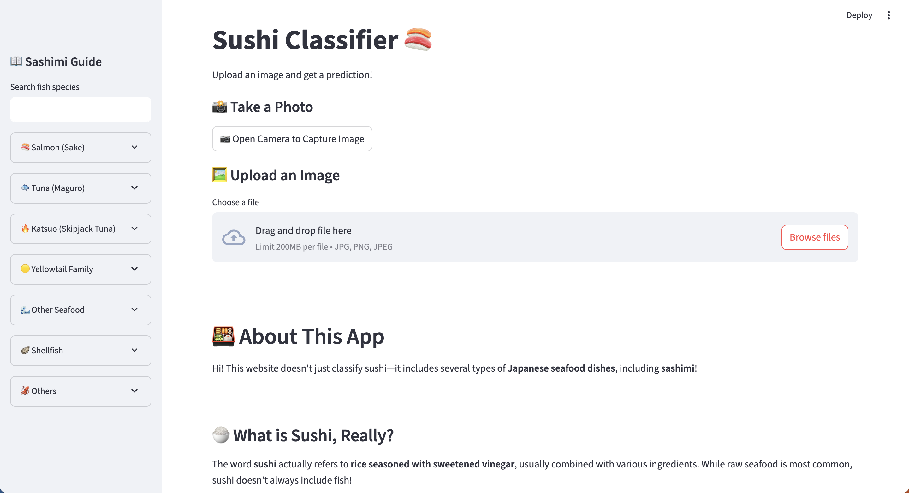
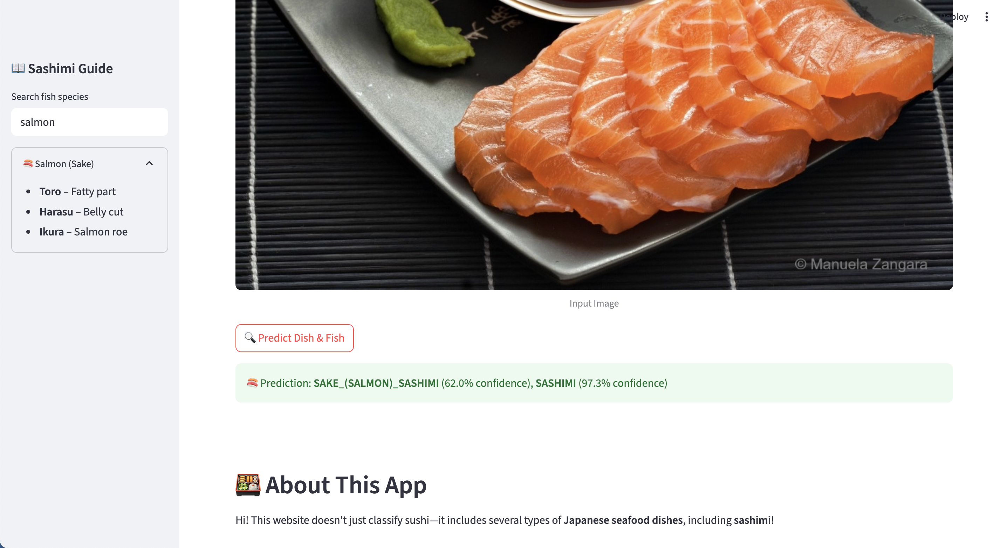

# 🍣 Sushi Classifier App

_A sushi companion for the introverted foodie._

Every sushi enthusiast has experienced it. You pick up that paradigm of a delicacy, and take a bite. It's delightfully silky, incredibly flavorful, just melts in your mouth. But *what is it*? Too shy to bother the waiter, to embarrassed to ask the chef...you blush at your ignorant, wannabe-connoisseur status.

Too many times I've eaten something delicious whilst not knowing anything about it. Deciding to end the games at last, I built an image classifier to identify different kinds of Japanese seafood dishes along with the species of fish used in them.

  
  

---

## 🛠️ Project Milestones

### ~~Basics~~ ✅

- **Build a basic classifier using PyTorch** ✅ -> Used Resnet18

  - Experiment with different architectures
  - Research and document findings
  - Limit to two types of sashimi - salmon and otoro

- **Data Collection** ✅

  - Manually curate and label a dataset
  - Train the initial model

- **Add a Frontend** ✅ -> Used Streamlit
  - Let users upload or take pictures
  - Optionally incorporate user-submitted images into the dataset

---

### Desirable Features

- **Create a custom classifier**

- **Expand the Dataset** ✅ -> Used Google API
  - Include more types of sashimi
  - Automate data gathering & processing
  -
- **Go Beyond Sashimi** ✅ -> Classifies different types of sushi

- **Extend to Images with Multiple Difference Pieces of Sashimi** ❌ -> Unable to label bounding boxes

  - Reflect in frontend, attaching labels to each 'group' of fish

- **Add Benchmarking**
  - Measure and improve speed and accuracy
  - Compare model performance over time

---

### Above and Beyond

- Implement unit tests for critical components
- Add location-based sushi recommendations (Automated _Beli_?)

---
